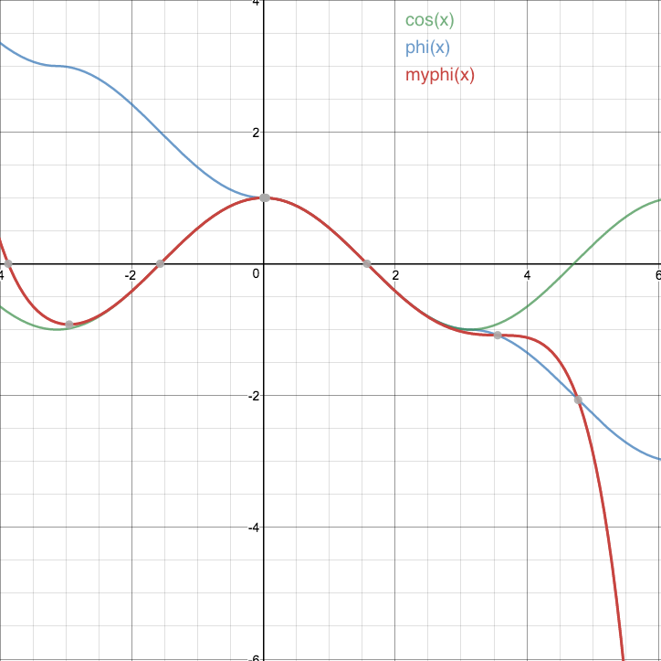

# Face_Recognition_IN_Video

## About
This is a desktop programe for finding and marking the faces required in videos.
## Requirement
- python36

  I use python36 in this programe for using pytorch.

- Pytorch 

  Only Pytorch.02+ can work in this programe.If you want using GPU to make it run faster,please download and install Cuda.

- Mxnet
  
  I use Mtcnn for detecting face from videos which need Mxnet.

- OpenCV

  Dealing image such as resizing,converting coler and more.

- PyQT5

  Using this third package pyQT5 just for UI realization of the programe.

## Using

run:
  --python main.py-
  
## README_MTCNN_face_detection_and_alignment

# MTCNN_face_detection_and_alignment

## About

  This is a python/mxnet implementation of [Zhang](https://kpzhang93.github.io/)'s work **<Joint Face Detection and Alignment using Multi-task Cascaded Convolutional Neural Networks>**. it's fast and accurate,  see [link](https://github.com/kpzhang93/MTCNN_face_detection_alignment). 

  It should have **almost** the same output with the original work,  for mxnet fans and those can't afford matlab :)

[中文blog](https://pangyupo.github.io/2016/10/22/mxnet-mtcnn/)

## Requirement	  

- opencv 

  ​	I use cv2 for image io and resize(much faster than skimage), the input image's channel is acutally BGR

- mxnet 

  ​	**please update to the newest version, we need 'full' mode in Pooling operation**

Only tested on Linux and Mac

## Test

run:

 ``python main.py`` 

you can change `ctx` to `mx.gpu(0)` for faster detection

--- update 20161028 ---

by setting ``num_worker=4``  ``accurate_landmark=False`` we can reduce the detection time by 1/4-1/3, the bboxes are still the same, but we skip the last landmark fine-tune stage( mtcnn_v1 ). 

--- update 20161207 ---

add function `extract_face_chips`, examples:


see `mtcnn_detector.py` for the details about the parameters. this function use [dlib](http://dlib.net/)'s align strategy, which works well on profile images :) 
## Results


## License

MIT LICENSE

## Reference

K. Zhang and Z. Zhang and Z. Li and Y. Qiao Joint,  Face Detection and Alignment Using Multitask Cascaded Convolutional Networks, IEEE Signal Processing Letters

## README_SphereFace

# SphereFace

## Introduction

The repository contains the entire pipeline (including all the preprocessings) for deep face recognition with **`SphereFace`**. The recognition pipeline contains three major steps: face detection, face alignment and face recognition.

SphereFace is a recently proposed face recognition method. It was initially described in an [arXiv technical report](https://arxiv.org/abs/1704.08063) and then published in [CVPR 2017](http://openaccess.thecvf.com/content_cvpr_2017/papers/Liu_SphereFace_Deep_Hypersphere_CVPR_2017_paper.pdf). The most up-to-date paper with more experiments can be found at [arXiv](https://arxiv.org/abs/1704.08063) or [here](http://wyliu.com/papers/LiuCVPR17v3.pdf). To facilitate the face recognition research, we give an example of training on [CAISA-WebFace](http://www.cbsr.ia.ac.cn/english/CASIA-WebFace-Database.html) and testing on [LFW](http://vis-www.cs.umass.edu/lfw/) using the **20-layer CNN architecture** described in the paper (i.e. SphereFace-20). 

In SphereFace, our network architecures use residual units as building blocks, but are quite different from the standrad ResNets  (e.g., BatchNorm is not used, the prelu replaces the relu, different initializations, etc). We proposed 4-layer, 20-layer, 36-layer and 64-layer architectures for face recognition (details can be found in the [paper]((https://arxiv.org/pdf/1704.08063.pdf)) and [prototxt files](https://github.com/wy1iu/sphereface/blob/master/train/code/sphereface_model.prototxt)). We provided the 20-layer architecure as an example here. If our proposed architectures also help your research, please consider to cite our paper.

SphereFace achieves the state-of-the-art verification performance (previously No.1) in [MegaFace Challenge](http://megaface.cs.washington.edu/results/facescrub.html#3) under the small training set protocol.
A PyTorch Implementation of SphereFace.
The code can be trained on CASIA-Webface and the best accuracy on LFW is **99.22%**.

[SphereFace: Deep Hypersphere Embedding for Face Recognition](https://arxiv.org/abs/1704.08063)

# Train
```
python train.py
```

# Test
```
# lfw.tgz to lfw.zip
tar zxf lfw.tgz; cd lfw; zip -r ../lfw.zip *; cd ..

# lfw evaluation
python lfw_eval.py --model model/sphere20a_20171020.pth
```

# Pre-trained models
| Model name      | LFW accuracy | Training dataset |
|-----------------|--------------|------------------|
| [20171020](model/sphere20a_20171020.7z) | 0.9922 | CASIA-WebFace |

# φ


=1-\frac{x^2}{2!}+\frac{x^4}{4!}-\frac{x^6}{6!}+\frac{x^8}{8!}-\frac{x^9}{9!})



# References
[sphereface](https://github.com/wy1iu/sphereface)
## Reference

[Mtcnn for face detection](https://github.com/pangyupo/mxnet_mtcnn_face_detection)

[Sphereface_pytorch for face recognition](https://github.com/clcarwin/sphereface_pytorch)

[paper of MTCNN](ReferencePaper/mtcnn.pdf)

[paper of Sphereface](ReferencePaper/shpereface.pdf)
